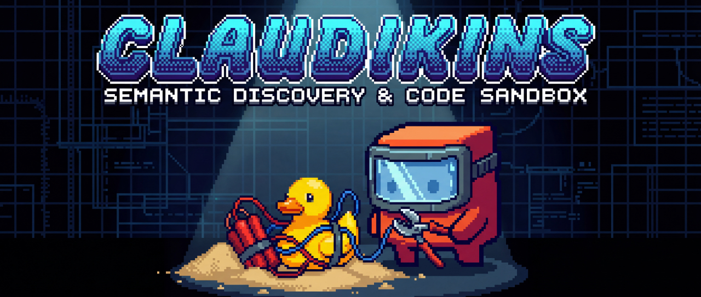

<p align="center">
  
</p>

<h1 align="center">Claudikins Tool Executor</h1>

<p align="center">
  <strong>Slim tool definitions. Auto-compressed responses. Context efficiency on both ends.</strong>
</p>

<p align="center">
  <a href="#quick-start">Quick Start</a> •
  <a href="#the-3-tools">The 3 Tools</a> •
  <a href="#configuration">Configuration</a> •
  <a href="#wrapped-servers">Wrapped Servers</a>
</p>

---

## The Problem

Every MCP server you add to Claude Code consumes context tokens for tool definitions. Add a few servers and suddenly **25% of your context window is gone** before you've written a single prompt.

And when those MCP tools return large responses? Straight into context. A web scrape, a code analysis, an image generation - all eating your precious tokens.

## The Solution

Tool Executor is a **reverse proxy for MCP servers**. Instead of exposing 100+ tool schemas directly, it provides 3 context-efficient tools with semantic search and automatic response management.

| Setup | Tools Loaded | Tokens | Context Used |
|-------|-------------|--------|--------------|
| Direct MCP (9 servers) | 102 | ~50,000 | 25% |
| **Tool Executor** | **3** | **~1,100** | **0.5%** |

**98% reduction in tool definition overhead.**

But that's only half the story. Large MCP responses are automatically saved to workspace files, returning only a tiny reference. Your context stays lean even when tools return massive payloads.

---

## Quick Start

### Install via Claude Code Plugin

```bash
# Add the Claudikins marketplace
/marketplace add aMilkStack/claudikins-marketplace

# Install the plugin
/plugin install claudikins-tool-executor
```

Restart Claude Code. You now have access to `search_tools`, `get_tool_schema`, and `execute_code`.

### First Search

```
Use search_tools to find image generation tools
```

### First Execution

```typescript
// After getting the schema for gemini-generate-image
await gemini["gemini-generate-image"]({
  prompt: "A robot writing documentation",
  aspectRatio: "16:9"
});
```

---

## The 3 Tools

### 1. `search_tools` - Discover What's Available

Semantic search across all wrapped MCP servers. Find tools without loading their schemas.

**Input:**
```json
{
  "query": "image generation",
  "limit": 5,
  "offset": 0
}
```

**Output:**
```json
{
  "results": [
    { "name": "gemini-generate-image", "server": "gemini", "description": "Generate images..." },
    { "name": "gemini-generate-video", "server": "gemini", "description": "Generate videos..." }
  ],
  "count": 2,
  "has_more": false
}
```

**Example queries:**
- `"semantic code search"` - Find Serena code navigation tools
- `"web scraping"` - Find Apify tools
- `"UI components"` - Find shadcn tools

---

### 2. `get_tool_schema` - Get Full Parameters

Once you've found a tool, fetch its complete schema before calling it.

**Input:**
```json
{
  "name": "gemini-generate-image"
}
```

**Output:**
```json
{
  "name": "gemini-generate-image",
  "server": "gemini",
  "description": "Full description...",
  "inputSchema": { /* JSON Schema */ },
  "example": "await gemini[\"gemini-generate-image\"]({...})"
}
```

---

### 3. `execute_code` - Run TypeScript with MCP Access

Execute TypeScript/JavaScript with pre-connected MCP clients and a workspace API.

**Input:**
```json
{
  "code": "const result = await gemini[\"gemini-query\"]({ prompt: \"Hello\" }); console.log(result);",
  "timeout": 30000
}
```

**Available in the sandbox:**

| Global | Description |
|--------|-------------|
| `gemini` | Gemini AI tools (query, image gen, analysis) |
| `serena` | Semantic code search and navigation |
| `apify` | Web scraping and automation |
| `context7` | Context management |
| `notebooklm` | Notebook analysis |
| `shadcn` | UI component tools |
| `sequentialThinking` | Reasoning tools |
| `workspace` | File API for persistent storage |
| `console` | Logging (captured and returned) |

**Workspace API:**
```typescript
// Write and read files
await workspace.write("output.txt", "Hello");
const content = await workspace.read("output.txt");

// JSON helpers
await workspace.writeJSON("data.json", { foo: "bar" });
const data = await workspace.readJSON("data.json");

// List and check files
const files = await workspace.list(".");
const exists = await workspace.exists("output.txt");
```

---

## The Auto-Save Magic

When an MCP tool returns a response larger than 200 characters, it's automatically saved to the workspace. Your code receives a reference instead of the full payload:

```typescript
const result = await gemini["gemini-query"]({ prompt: "Explain quantum computing in detail" });

// If response is large, result looks like:
// { _savedTo: "mcp-results/1705312345678.json", _preview: "Quantum computing...", _size: 15234 }

// Read the full response only when needed:
const fullResponse = await workspace.readJSON(result._savedTo);
```

**Context stays lean. Large results stay accessible.**

---

## Configuration

Tool Executor works out of the box with sensible defaults. For custom setups, create `tool-executor.config.json`:

```json
{
  "servers": [
    {
      "name": "myserver",
      "displayName": "My Custom Server",
      "command": "npx",
      "args": ["-y", "my-mcp-package"],
      "env": {
        "API_KEY": "${MY_API_KEY}"
      }
    }
  ]
}
```

**Environment Variables:**

Some servers require API keys. Set them in your environment:

```bash
export GEMINI_API_KEY="your-key"
export APIFY_TOKEN="your-token"
```

---

## Wrapped Servers

Tool Executor comes pre-configured with 7 MCP servers:

| Server | Category | Tools | What It Does |
|--------|----------|-------|--------------|
| **Gemini** | AI Models | 26 | Image/video generation, queries, analysis |
| **Serena** | Code Nav | 11 | Semantic code search, project navigation |
| **Apify** | Web | 17 | Web scraping, actor management |
| **Context7** | Knowledge | 9 | Context management |
| **NotebookLM** | Knowledge | 13 | Notebook analysis |
| **shadcn** | UI | 10 | UI component tools |
| **Sequential Thinking** | Reasoning | 1 | Step-by-step reasoning |

**Total: 87 tools accessible through 3.**

---

## Advanced Patterns

### Chaining Tools

```typescript
// Search for relevant tools
const searchResult = await search_tools({ query: "summarize text" });

// Get the schema
const schema = await get_tool_schema({ name: "gemini-summarize" });

// Execute with full knowledge of parameters
const summary = await gemini["gemini-summarize"]({
  text: "Long document here...",
  format: "bullets"
});
```

### Working with Large Responses

```typescript
// Scrape a webpage (potentially large)
const scrapeResult = await apify["apify-scrape"]({ url: "https://example.com" });

// If auto-saved, read from workspace
if (scrapeResult._savedTo) {
  const fullData = await workspace.readJSON(scrapeResult._savedTo);
  // Process fullData...
}
```

### Persistent Analysis Workflows

```typescript
// Save intermediate results
await workspace.writeJSON("analysis/step1.json", intermediateData);

// Continue in a later execution
const step1 = await workspace.readJSON("analysis/step1.json");
// Build on previous work...
```

---

## When NOT to Use This

Tool Executor is optimised for **breadth over depth**. Consider direct MCP connections if:

- You only use 1-2 MCP servers (overhead isn't worth it)
- You need real-time streaming responses
- You're building a production pipeline (use direct SDK integration)
- You need sub-100ms latency on every call

---

## Architecture

```
┌─────────────────────────────────────────────────────────────┐
│                     Claude Code                              │
└─────────────────────────┬───────────────────────────────────┘
                          │ 3 tools (~1.1k tokens)
                          ▼
┌─────────────────────────────────────────────────────────────┐
│                   Tool Executor                              │
│  ┌─────────────┐  ┌──────────────┐  ┌─────────────────┐    │
│  │search_tools │  │get_tool_schema│  │  execute_code   │    │
│  └──────┬──────┘  └──────┬───────┘  └────────┬────────┘    │
│         │                │                    │             │
│         ▼                ▼                    ▼             │
│  ┌─────────────────────────────────────────────────────┐   │
│  │              Registry (97 tool definitions)          │   │
│  │         Serena semantic search + BM25 fallback       │   │
│  └─────────────────────────────────────────────────────┘   │
│                                                             │
│  ┌─────────────────────────────────────────────────────┐   │
│  │                    Sandbox Runtime                   │   │
│  │   • Lazy MCP client connections (pooled)            │   │
│  │   • Auto-save large responses to workspace          │   │
│  │   • TypeScript execution with timeout               │   │
│  └──────────────────────┬──────────────────────────────┘   │
└─────────────────────────┼───────────────────────────────────┘
                          │
        ┌─────────────────┼─────────────────┐
        ▼                 ▼                 ▼
   ┌─────────┐      ┌─────────┐       ┌─────────┐
   │ Gemini  │      │ Serena  │       │  Apify  │  ... (7 servers)
   └─────────┘      └─────────┘       └─────────┘
```

---

## CLI Commands

Tool Executor includes a CLI for diagnostics:

```bash
# Check server health
claudikins doctor

# Extract schemas from live servers
claudikins extract --all

# Initialize config file
claudikins init
```

---

## Skills & Hooks

As a Claude Code plugin, Tool Executor includes:

**Skills:**
- `/te-doctor` - Diagnose connection issues
- `/te-guide` - Usage guidance and examples
- `/te-config` - Configuration help

**Hooks:**
- `SessionStart` - Initialises the tool executor
- `UserPromptSubmit` - Activates tool discovery on relevant prompts

---

## Part of the Claudikins Framework

Tool Executor is one component of Claudikins, a collection of Claude Code plugins:

- **Tool Executor** - Context-efficient MCP wrapper (you are here)
- **Automatic Context Manager** - Seamless context handoff
- **Klaus** - Debugging with Germanic flair
- **GRFP** - README generation through dual-AI analysis

[View the marketplace →](https://github.com/aMilkStack/claudikins-marketplace)

---

## License

MIT

---

<p align="center">
  <sub>Built with obsessive context efficiency by <a href="https://github.com/aMilkStack">Ethan Lee</a></sub>
</p>
